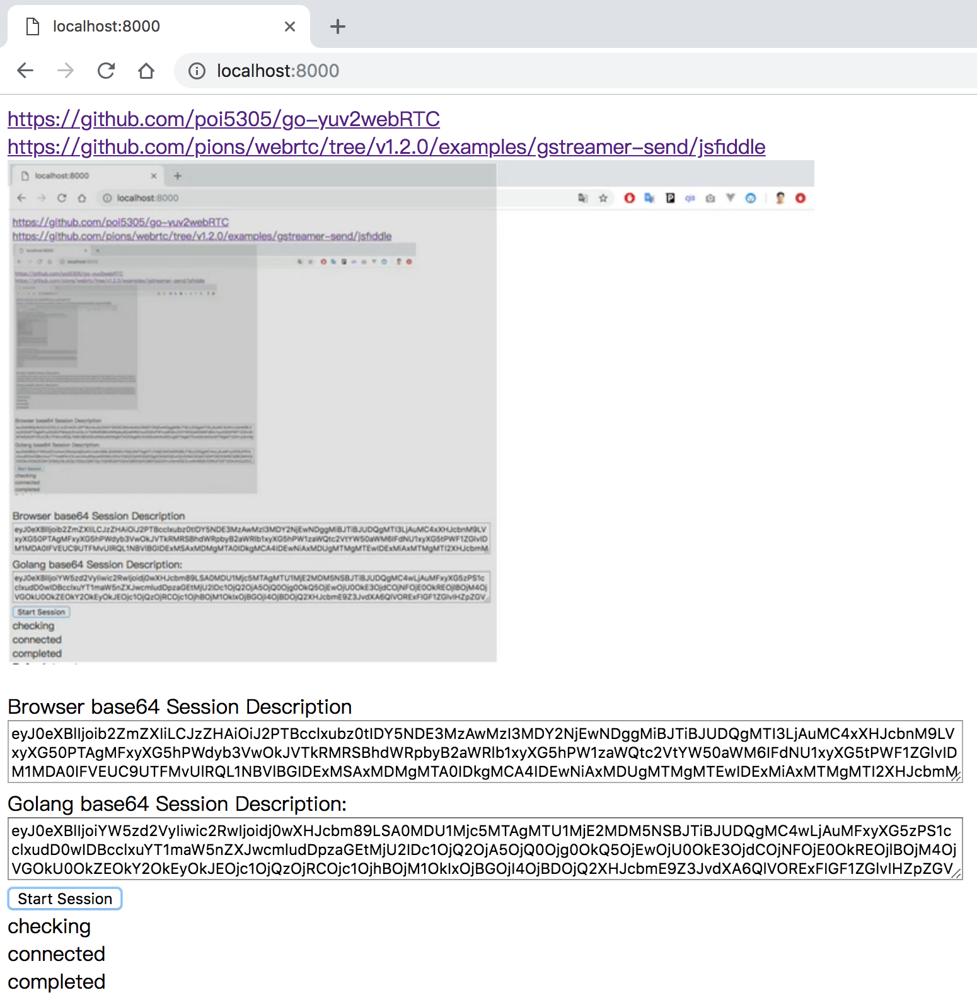

## Notes

Update pion/webrtc version to v2.1.18

## Install

```
# mac
brew install libvpx pkg-config

# linux
apt-get install libvpx-dev
```

```
go get github.com/poi5305/go-yuv2webRTC/...
```

## Test

```
cd $GOPATH/github.com/poi5305/go-yuv2webRTC
go run main.go
```

Open http://localhost:8000

And press `Start Session`



## Android Test

#### Build aar with gomobile

```
cd gomobile-lib
sh build.sh
```

#### Build Android and Run

1. open in Android Studio and Build it
2. open http://phoneIp:8000 in web
3. click Start Session

